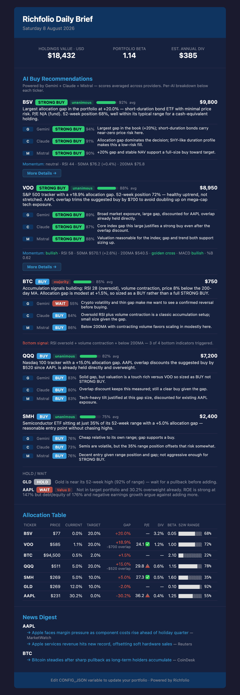
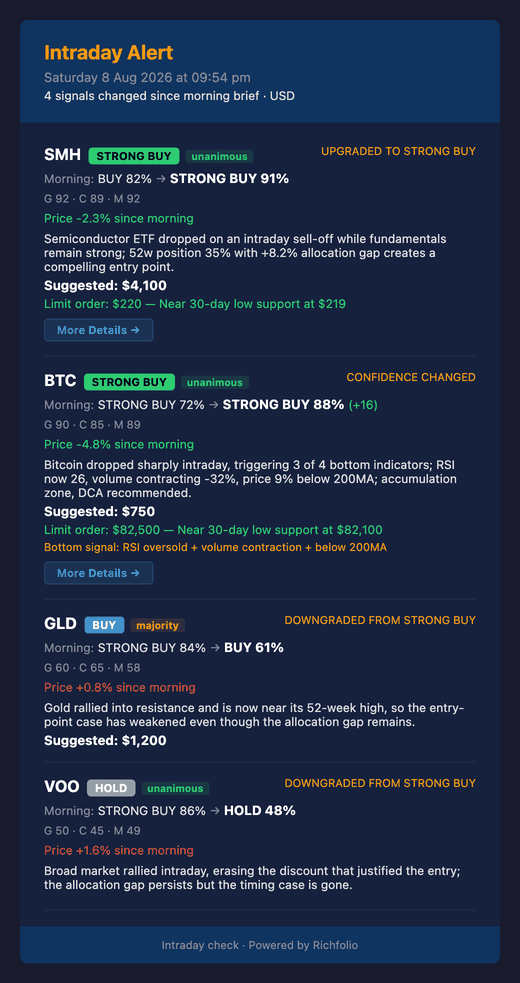

# 작동 방식

Richfolio는 단일 파이프라인 시스템입니다 — API 서버도, 데이터베이스도, 대시보드도 없습니다. 한 번 실행되어 리포트를 생성한 뒤 종료됩니다.

---

## 데이터 파이프라인

```
CONFIG_JSON variable + GitHub Secrets
  → fetchPrices (Yahoo Finance: prices, P/E, 52w range, beta, dividends, ETF holdings, fundamentals, earnings calendar)
  → fetchTechnicals (Yahoo Finance chart: SMA50, SMA200, RSI, MACD, Bollinger Bands, ATR, Stochastic, OBV, momentum)
  → fetchNews (NewsAPI: top headlines per ticker + Gemini sentiment scoring)
  → analyze (allocation gaps, P/E signals, overlap discounts, portfolio metrics)
  → aiAnalyze (Gemini two-stage Think/Plan: Stage 1 Observe → Stage 2 Decide + reasoning history)
  → guards (post-AI validation: earnings guard, STRONG BUY criteria, bond cap, confidence/value sanity)
  → email + telegram (deliver daily brief with value ratings, bottom signals, technicals, earnings badges)
```

주간 모드(`--weekly`)는 뉴스, 기술적 지표, AI를 건너뛰고 리밸런싱에 집중한 리포트를 생성합니다.

장중 모드(`--intraday`)는 가격과 기술적 지표를 다시 가져오고, AI를 재실행(뉴스 생략)한 뒤, 아침 기준선과 비교하여 신호가 강해질 때만 알림을 보냅니다.

암호화폐 모드(`--crypto`)는 포트폴리오 파이프라인을 완전히 건너뜁니다. `watchingCrypto`의 교차 페어를 crypto.com에서 가져와 동일한 기술적 지표·AI 단계·가드를 적용하고, 아침 기준선이 아니라 그날의 앵커와 비교합니다.

---

## 아키텍처

```
src/
├── config.ts          # Typed loader for CONFIG_JSON variable + GitHub Secrets
├── index.ts           # Entry point — parses --weekly/--intraday flags, wires modules
├── fetchPrices.ts     # Yahoo Finance via yahoo-finance2 (instance-based v3 API) + fundamentals + earnings calendar
├── fetchTechnicals.ts # Yahoo Finance chart: SMA50, SMA200, RSI, MACD, Bollinger Bands, ATR, Stochastic, OBV
├── fetchNews.ts       # NewsAPI with ticker-to-company-name mapping + Gemini sentiment scoring
├── analyze.ts         # Core analysis: gaps, P/E signals, overlap, portfolio metrics
├── aiAnalysis.ts      # Two-stage Gemini Think/Plan prompt builder + JSON response parser + retry logic
├── guards.ts          # Post-AI validation pipeline: 6 sequential safety checks
├── detailedAnalysis.ts# Gemini 2.5 Flash: detailed buy thesis + risk analysis for STRONG BUY tickers
├── analysisUrl.ts     # Compress analysis data into URL hash for the GitHub Pages analysis page
├── state.ts           # Morning baseline save/load for intraday comparison + 7-day reasoning history
├── intradayCompare.ts # Compare current AI recs vs morning baseline
├── email.ts           # Daily HTML email template + Resend delivery
├── intradayEmail.ts   # Intraday alert email template + Resend delivery
├── weeklyEmail.ts     # Weekly rebalancing email template + Resend delivery
└── telegram.ts        # Telegram Bot API delivery (daily + intraday + weekly formatters)
```

각 모듈은 독립적입니다 — 타입이 지정된 인터페이스(`QuoteData`, `TechnicalData`, `AllocationItem`, `AllocationReport`, `AIBuyRecommendation`, `IntradayAlert`, `TickerObservation`)를 통해 통신합니다. `QuoteData`에는 Yahoo의 `financialData` 모듈에서 가져온 펀더멘털 데이터(ROE, 부채/자본, FCF, 마진, 성장률)와 실적 캘린더 데이터(다음 실적 발표일, 실적까지 남은 일수)가 포함됩니다. `TechnicalData`에는 MACD(크로스 + 히스토그램), 볼린저 밴드(%B, 밴드폭, 스퀴즈), ATR(변동성), 스토캐스틱(%K/%D), OBV 추세(매집/분산), 그리고 바닥 감지를 위한 거래량 변화(7일 vs 30일)가 포함됩니다. `TickerObservation`은 Think 단계의 중간 산출물로, 구조화된 신호, 리스크 플래그, 요약을 담고 있습니다.

---

## 분석 로직

### 배분 격차

목표 포트폴리오의 각 종목에 대해:

1. **현재 가치** = 보유 주식 수 × 현재 가격
2. **현재 %** = 현재 가치 / 포트폴리오 가치 × 100
3. **격차 %** = 목표 % − 현재 %
4. **추천 매수** = 격차 % × 포트폴리오 가치 (비중 부족일 때만)

포트폴리오 가치는 실제 보유 가치와 설정된 `totalPortfolioValue` 중 더 큰 값을 사용합니다.

시스템은 다음 통화 중 어느 것으로든 표시된 포트폴리오를 지원합니다: USD, GBP, EUR, AUD, CAD, JPY, CHF, HKD, SGD, NZD. 설정에서 `defaultCurrency`를 원하는 표시 통화로 지정하세요. 다른 통화로 가격이 표시되는 종목(예: GBp로 표시되는 영국 LSE 주식)은 자동 감지되어 단위가 보정되고(LSE 펜스 ÷ 100), Yahoo Finance를 통해 환율 변환되어 표시됩니다.

### 동적 P/E 신호

Yahoo Finance는 `earningsHistory`를 통해 분기별 EPS 데이터를 제공합니다. Richfolio는 다음과 같이 계산합니다:

1. 양수인 분기별 EPS 값을 필터링 (최소 2개 분기 필요)
2. 평균 분기 EPS → 연환산 (× 4)
3. **평균 P/E** = 현재 가격 / 연환산 EPS
4. 후행 P/E를 이 평균과 비교:
   - **평균 미만** → 잠재적 가치 기회
   - **평균 초과** → 잠재적 고평가

ETF와 암호화폐는 이 신호를 건너뜁니다 (실적 데이터 없음).

### ETF 중첩 감지

각 목표 ETF에 대해 Yahoo Finance는 상위 약 10개 보유 종목과 비중을 반환합니다. Richfolio는 본인이 그 주식들을 직접 보유하고 있는지 확인합니다:

1. `currentHoldings`의 주식과 일치하는 ETF 보유 종목에 대해:
   - **ETF 노출** = 보유 비중 × ETF의 추천 매수 금액
   - **본인 노출** = 보유 주식 수 × 주가
   - **중첩** = min(ETF 노출, 본인 노출)
2. 해당 ETF의 모든 중첩을 합산
3. ETF의 추천 매수 금액에서 총 중첩만큼 차감

**예시:** VOO는 약 7% AAPL을 포함합니다. AAPL을 $8,000 보유하고 있고 VOO의 추천 매수가 $10,000라면, AAPL 중첩은 min(7% × $10,000, $8,000) = $700입니다. VOO의 매수 추천은 $9,300으로 감소합니다.

### 52주 범위 스코어링

각 종목의 가격은 52주 범위 내 위치로 산정됩니다:

- **0–20%** → 52주 저점 근접 (매수 기회 신호)
- **20–80%** → 중간 영역 (중립)
- **80–100%** → 52주 고점 근접 (주의 신호)

### 기술적 지표

Richfolio는 `yahooFinance.chart()`를 통해 약 250일치 일봉 OHLCV 데이터를 가져와 다음을 계산합니다:

1. **SMA50** — 최근 50개 종가의 단순 이동평균
2. **SMA200** — 최근 200개 종가의 단순 이동평균 (데이터 포인트가 200 미만이면 null)
3. **RSI(14)** — 14일 평균 상승/하락폭을 이용한 표준 상대강도지수
4. **MACD** — EMA(12) − EMA(26), 시그널 라인 = MACD 라인의 EMA(9). 히스토그램(MACD − 시그널, 양수 = 강세 모멘텀)을 보고하고 최근 2거래일에서 강세/약세 크로스를 감지합니다. 35개 이상의 데이터 포인트 필요. 추세 방향 확인에 적합
5. **볼린저 밴드** — SMA(20) ± 2 표준편차. %B(0 = 하단, 1 = 상단), 밴드폭(변동성 측정), 스퀴즈 감지(밴드폭이 120일 범위의 하위 20%에 있으면 임박한 돌파를 시사)를 보고합니다. 20개 이상의 데이터 포인트 필요. 박스권 시장에 적합
6. **모멘텀 신호**:
   - **강세** — 가격 > SMA50, SMA50 > SMA200, RSI > 40
   - **약세** — 가격 < SMA50, SMA50 < SMA200, RSI < 60
   - **중립** — 혼합 신호
7. **ATR(14)** — Wilder 스무딩이 적용된 평균 진폭. 절대값과 가격 대비 %를 보고합니다. ATR% > 3% = 고변동성(지정가 넓힘), ATR% < 1% = 저변동성(지정가 타이트). 15개 이상의 데이터 포인트 필요
8. **스토캐스틱 오실레이터** — %K(14)와 3일 SMA 스무딩 %D. %K < 20 = 과매도 확인(STRONG BUY 기준의 모멘텀 신호에 포함), %K > 80 = 과매수. 16개 이상의 데이터 포인트 필요
9. **OBV 추세** — 평균 거래량으로 정규화된 10일 선형 회귀 기울기와 함께한 On-Balance Volume. 방향만 보고: 상승(매집), 하락(분산), 또는 횡보. OBV 절대값은 종목 간 비교가 의미 없습니다. 11개 이상의 데이터 포인트 필요
10. **골든/데드 크로스** — SMA50이 SMA200을 위로(골든) 또는 아래로(데드) 돌파
11. **최근 저점** — 최근 7일 및 30일의 최저가 (지지선)
12. **거래량 변화** — 7일 평균 거래량 vs 직전 30일 평균 (바닥 신호 모델이 매도세 소진을 감지하는 데 사용)

데이터 포인트가 50개 미만인 종목은 우아하게 건너뜁니다. 모든 지표는 기존 차트 데이터로부터 계산됩니다 — 추가 API 호출 없음.

### AI 스코어링 (두 단계 Think/Plan)

Richfolio는 [OpenAlice](https://github.com/TraderAlice/OpenAlice)의 인지 아키텍처에서 영감을 받은 두 단계 AI 프레임워크를 사용합니다:

**1단계 — Observe (Think):** Gemini 프롬프트가 종목별 모든 데이터 포인트를 받습니다 — 가격, P/E 비율, 52주 위치, 배분 격차, 배당 수익률, 베타, ETF 중첩, 기술적 지표(이동평균, RSI, MACD, 볼린저 밴드, ATR, 스토캐스틱, OBV, 모멘텀, 거래량 변화), 펀더멘털 데이터(ROE, 부채/자본, FCF, 마진, 성장률, 애널리스트 목표가), 실적 캘린더, 매크로 환경, 그리고 감성 점수가 포함된 최근 헤드라인. AI는 구조화된 관찰을 추출합니다: 어떤 가격대 신호가 존재하는지, 어떤 모멘텀 신호가 작동 중인지, 리스크 플래그, 요약, 뉴스 감성. 이 단계에서는 매매 추천이 없습니다.

**2단계 — Decide (Plan):** 별도의 Gemini 호출이 1단계의 구조화된 관찰, 의사결정 규칙, 격차 금액, 매크로 컨텍스트, 그리고 7일치 추론 이력을 받습니다. 이미 가공된 관찰(원시 숫자가 아닌)을 다루기 때문에 STRONG BUY 기준을 더 일관되게 적용합니다. AI는 다음을 반환합니다:

- **액션**: STRONG BUY, BUY, HOLD, 또는 WAIT
- **신뢰도**: 0–100%
- **이유**: 1–2 문장 설명
- **추천 금액**: 투자할 USD
- **지정가 가격**: 가장 가까운 지지(이동평균, 최근 저점, 라운드 넘버) 기반의 시장가 이하 추천 가격
- **지정가 이유**: 지지선을 설명하는 1 문장
- **가치 등급**: 개별 주식의 A/B/C/D (ETF와 암호화폐는 비어 있음)
- **바닥 신호**: 과매도/매집 구간 설명 (지표가 없으면 비어 있음)

#### 가치 투자 프레임워크 (주식 전용)

AI는 다섯 가지 펀더멘털 기준을 바탕으로 각 개별 주식에 A–D 등급을 매깁니다: ROE > 15%, 부채/자본 < 50%, FCF/영업현금흐름 > 80%, 이익 성장률 플러스, 주가가 애널리스트 목표가 이하. 이 등급은 AI의 신뢰도 점수를 조정합니다 (A는 약 10점 가산, D는 약 10점 차감). 펀더멘털 데이터는 Yahoo의 `financialData` 모듈에서 옵니다 — 기존 `quoteSummary` 호출에 추가되어 추가 API 부담 없음.

#### 바닥 신호 모델 (모든 종목)

AI는 모든 종목(주식, ETF, 암호화폐)에 대해 네 가지 바닥 지표를 평가합니다: RSI < 30, 거래량 위축 > 20%, 가격이 200일선 이하, 데드 크로스. 암호화폐는 지표 2개 이상에서 바닥 신호가 발동되고, 주식과 ETF는 3개 이상이 필요합니다(단일 하락으로 인한 오탐을 피하기 위한 더 엄격한 임계값). 거래량 변화는 기존 차트 데이터에서 계산됩니다 — 추가 API 호출 없음.

기술적 지표는 AI의 신뢰도를 더 정교하게 다듬습니다 — 과매도 RSI를 동반한 강세 모멘텀 신호는 매수 논거를 강화하고, 약세 신호나 과매수 RSI는 약화시킵니다. AI는 명시적인 **지표 충돌 해결 계층**을 따릅니다: 추세 시장에서는 MACD를, 박스권 시장에서는 볼린저 밴드를 신뢰합니다. 두 지표가 일치하면(예: 강세 MACD 크로스 + 볼린저 하단 반등) 신뢰도가 5–10점 상승합니다. 볼린저 스퀴즈와 동시에 발생하는 MACD 크로스는 가장 강한 진입 신호로 취급됩니다(신뢰도 10–15점 상승). 두 지표가 충돌하면(예: 강세 MACD이지만 %B가 상단 근접) 과한 진입을 피하기 위해 신뢰도가 낮춰집니다.

AI가 추천을 반환한 후 **가드 검증 파이프라인**(`guards.ts`)이 6가지 순차 검사를 실행합니다: 채권 ETF 상한, 실적 임박, STRONG BUY 기준 강제, STRONG BUY 최대 2개, 신뢰도 정상화, 매수 금액 정상화. 가드는 AI가 프롬프트 명령을 무시하는 경우를 잡아내고 프로그램적인 안전망 역할을 합니다.

Gemini를 사용할 수 없는 경우 시스템은 격차 기반 순위(가장 큰 배분 격차 우선)로 폴백합니다. 일시적인 Gemini 오류(503/429)는 5초/10초 백오프와 함께 최대 2회 자동 재시도된 후에 폴백됩니다.

### 상세 분석 페이지 (STRONG BUY 전용)

각 **STRONG BUY** 종목에 대해 별도의 Gemini 2.5 Flash 호출이 심층 매수 논거(3–4 문단)와 3–4개의 구체적인 리스크 요인을 생성합니다. 이 상세 분석은 모든 지표 및 기술 데이터와 함께 zlib으로 압축되어 base64url URL 해시 프래그먼트로 인코딩됩니다.

이메일과 Telegram 메시지에는 GitHub Pages에 호스팅된 정적 분석 페이지(`docs/analysis/index.html`)를 가리키는 **"More Details"** 링크가 포함됩니다. 페이지는 클라이언트 사이드에서 pako를 사용해 URL 해시를 디코딩하고 다음을 렌더링합니다:

- **인터랙티브 TradingView 차트** — SMA50, SMA200, RSI 오버레이가 포함된 6개월 캔들스틱
- **핵심 지표 그리드** — 가격, P/E, 52주 위치, RSI, 이동평균, 모멘텀
- **매수 논거** — Gemini Flash가 만든 다단락 상세 분석
- **리스크 분석** — 주시해야 할 구체적인 리스크 요인
- **펀더멘털** — ROE, 부채/자본, 마진, 성장률, 애널리스트 목표가 (주식 전용)
- **신호** — 골든/데드 크로스, 바닥 신호 (암호화폐)
- **액션 요약** — 추천 투자 금액, 근거가 포함된 지정가 가격
- **52주 범위 바** — 연간 범위 내 위치의 시각적 표시

서버 사이드 로직이 필요하지 않습니다 — 모든 데이터가 URL에 내장되어 있습니다. 한 번 로드되면 페이지는 오프라인에서도 동작합니다. URL은 보통 1,000–1,500자 정도이며 이메일 클라이언트 제한 내에 충분히 들어갑니다.

{: style="max-width: 500px; display: block; margin: 16px auto;" }

---

## 네 가지 모드

| | 일일 | 장중 | 주간 | 암호화폐 |
|---|---|---|---|---|
| 가격 및 펀더멘털 | 예 | 예 | 예 | crypto.com만 |
| 기술적 지표 | 예 | 예 | 아니오 | 예 |
| 뉴스 헤드라인 | 예 | 아니오 | 아니오 | 아니오 |
| AI 추천 | 예 | 예 | 아니오 | 예 |
| 지정가 가격 | 예 | 예 | 아니오 | 예 (표시 통화로) |
| 가치 등급 (주식) | 예 | 예 | 아니오 | 해당 없음 — 펀더멘털 없음 |
| 바닥 신호 (암호) | 예 | 예 | 아니오 | 예 |
| 배분 분석 | 예 | 예 | 예 | 해당 없음 — 관찰 전용 |
| 기준선 비교 | 기준선 저장 | 아침과 비교 | 아니오 | 그날의 앵커와 비교 |
| 이메일 템플릿 | 풀 브리핑 | 알림 (트리거 시에만) | 리밸런싱 표 | 알림 (트리거 시에만) |
| Telegram 형식 | AI 추천 + 뉴스 | 알림 (트리거 시에만) | BUY/TRIM 액션 | 알림 (트리거 시에만) |
| 스케줄 | 하루 1회 | 평일 하루 4회 | 매주 일요일 | 하루 8회 (전용 워크플로) |

다섯 번째 모드인 리프레시(`--refresh TICKER`)는 최신 가격으로 단일 티커를 필요할 때 재분석합니다.

{: style="max-width: 260px; display: inline-block;" }
{: style="max-width: 260px; display: inline-block;" }
{: style="max-width: 260px; display: inline-block;" }
